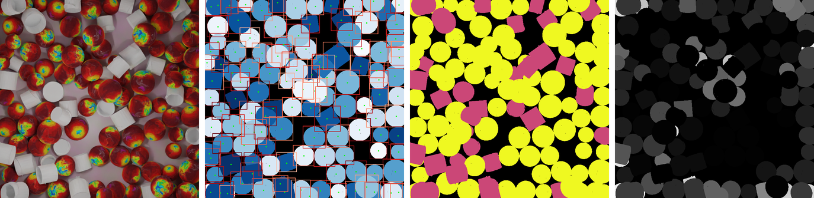

# Multi-Class Class-Agnostic Counting Dataset
**[Project Page](https://MCAC.active.vision/) |
[ArXiv](https://arxiv.org/abs/2309.04820) |
[Download](https://www.robots.ox.ac.uk/~lav/Datasets/MCAC/MCAC.zip)
**

[Michael Hobley](https://scholar.google.co.uk/citations?user=2EftbyIAAAAJ&hl=en), 
[Victor Adrian Prisacariu](http://www.robots.ox.ac.uk/~victor/). 

[Active Vision Lab (AVL)](https://www.robots.ox.ac.uk/~lav/),
University of Oxford.


Each object in the RGB image has an associated: Model ID, Class ID, Center Coordinate, Bounding Box and Occlusion.

MCAC is the first multi-class class-agnostic counting dataset. each image contains between 1 and 4 classes of
object and between 1 and 300 objects per class.
The classes of objects present in the Train, Test and Val splits are mutually exclusive, and where possible
aligned with the class splits in [FSC-133](https://github.com/ActiveVisionLab/LearningToCountAnything).
Each object is labeled with an instance, class and model number as well as its center coordinate, bounding box
coordinates and its percentage occlusion
Models are taken from [ShapeNetSem]. The original model IDs and manually
verified category labels are preserved.
MCAC-M1 is the single-class images from MCAC. This is useful when comparing methods that are not suited to
multi-class cases.

## Download 

Dowload MCAC [here](https://www.robots.ox.ac.uk/~lav/Datasets/MCAC/MCAC.zip).

File Hierarchy:

    ├── dataset_pytorch.py
    ├── make_gaussian_maps.py
    ├── test
    ├── train
    │   ├── 1511489148409439
    │   ├── 3527550462177290
    │   |   ├──img.png
    │   |   ├──info.json
    │   |   ├──seg.png
    │   ├──4109417696451021
    │   └── ...
    └── val
  
## Precompute Density Maps 
To precompute ground truth density maps for other resolutions, occlusion percentages, and gaussian standard deviations:

```sh
cd PATH/TO/MCAC/
python make_gaussian_maps.py  --occulsion_limit <desired_max_occlusion>  --crop_size 672 --img_size <desired_resolution> --gauss_constant <desired_gaussian_std>;
```

## Evaluation Bounding Boxes
For fair evaluation of methods which require exemplar bounding boxes we suggest using the 3 least occluded instances (lowest index breaking ties).
For ease of use, we have provided the indexs for all of these for the validation and training splits.

## Class Splits
```
train_class_labels = ['1Shelves', '2Shelves', '3Shelves', '4Shelves', '5Shelves', '6Shelves', '7Shelves', 'AAABattery', 'AABattery', 'AccentTable', 'AirConditioner', 'Airplane', 'ArcadeMachine', 'Armoire', 'Ashtray', 'Backpack', 'Bag', 'Ball', 'BarCounter', 'BarTable', 'Barstool', 'BaseballBat', 'Basket', 'Bathtub', 'Battery', 'BeanBag', 'Bear', 'Bed', 'BeerBottle', 'Bicycle', 'Bidet', 'Bird', 'Blender', 'Blind', 'Board', 'Bookcase', 'Booth', 'Bottle', 'Bowl', 'Broom', 'Bucket', 'Bus', 'Butterfly', 'Cabinet', 'Cabling', 'Cage', 'Camera', 'CanOpener', 'Candle', 'Canister', 'CanopyBed', 'Cap', 'Car', 'Carrot', 'Cassette', 'Cat', 'CeilingFan', 'CerealBox', 'Chaise', 'ChessBoard', 'ChestOfDrawers', 'ChildBed', 'Chocolate', 'Clock', 'Closet', 'Coaster', 'CoatRack', 'CoffeeMaker', 'CoffeeTable', 'Coin', 'Compass', 'Controller', 'Cookie', 'Couch', 'Counter', 'Courtyard', 'Cow', 'Cradle', 'Credenza', 'Cup', 'CurioCabinet', 'CuttingBoard', 'DSLRCamera', 'Dart', 'DartBoard', 'Desk', 'Desktop', 'Detergent', 'DiningTable', 'DiscCase', 'Dishwasher', 'Dog', 'Donkey', 'Door', 'DoubleBed', 'DraftingTable', 'Dresser', 'DresserWithMirror', 'DrinkBottle', 'DrumSet', 'Dryer', 'Easel', 'Elephant', 'EndTable', 'Eraser', 'Fan', 'Fan CeilingFan', 'Faucet', 'FileCabinet', 'Fireplace', 'Fish', 'FlagPole', 'Flashlight', 'Folder', 'Fork', 'Futon', 'GameTable', 'Gamecube', 'Giraffe', 'Guitar', 'GuitarStand', 'Gun', 'Hammer', 'HandDryer', 'Hanger', 'Harp', 'Hat', 'Headboard', 'Horse', 'Ipad', 'Ipod', 'IroningBoard', 'Kettle', 'Key', 'KingBed', 'Knife', 'LDesk', 'Ladder', 'LampPost', 'Laptop', 'Lectern', 'Letter', 'LightBulb', 'LightSwitch', 'Lock', 'LoftBed', 'Loveseat', 'Magnet', 'Marker', 'Mattress', 'MediaChest', 'MediaDiscs', 'MediaPlayer', 'MediaStorage', 'Microscope', 'Microwave', 'MilkCarton', 'Mirror', 'Monitor', 'Motorcycle', 'Mouse', 'MousePad', 'Mug', 'Nightstand', 'NintendoDS', 'Notepad', 'Orange', 'Ottoman', 'OutdoorTable', 'Oven', 'OvenTop', 'PS', 'PS2', 'PS3', 'PSP', 'Palette', 'Pan', 'Paper', 'PaperBox', 'PaperMoney', 'Pedestal', 'Pen', 'Pencil', 'Phone', 'Phonebooth', 'Piano', 'PianoKeyboard', 'PicnicTableSet', 'Picture', 'PillBottle', 'Pizza', 'Planet', 'Plate', 'Plotter', 'PosterBed', 'PotRack', 'PowerSocket', 'PowerStrip', 'Purse', 'QueenBed', 'QueenBedWithNightstand', 'Rabbit', 'Rack', 'Radio', 'Recliner', 'Refrigerator', 'RiceCooker', 'Ring', 'Rock', 'Room', 'RoundTable', 'Rug', 'Ruler', 'Sandwich', 'Scale', 'ScrewDriver', 'Sectional', 'Shampoo', 'Ship', 'Shirt', 'Shoes', 'ShoppingCart', 'Shower', 'Showerhead', 'Sideboard', 'SingleBed', 'SinkSleeper', 'Snowman', 'SoapBar', 'SoapBottle', 'SodaCan', 'Speaker', 'Spoon', 'StandingClock', 'Stapler', 'StaplerWithStaples', 'Statue', 'Suitcase', 'SupportFurniture', 'Sword', 'TV', 'Table', 'TableClock', 'Tank', 'Tape', 'TapeDispenser', 'TapeMeasure', 'Teacup', 'Telescope', 'TelescopeWithTripod', 'Tent', 'Thermostat', 'Thumbtack', 'TissueBox', 'Toaster', 'ToasterOven', 'Toilet', 'Toothbrush', 'TrashBin', 'Truck', 'Trumpet', 'Trundle', 'TvStand', 'USBStick', 'Umbrella', 'Vanity', 'Vase', 'VideoGameConsole', 'VideoGameController', 'Violin', 'WallClock', 'WallLamp', 'WallUnit', 'Wallet', 'Wardrobe', 'Washer', 'WasherDryerSet', 'WebCam', 'Whiteboard', 'Wii', 'Window', 'WineBottle', 'WineGlass', 'WineRack', 'Wood', 'Xbox', 'Xbox360']
val_class_labels = ['AccentChair', 'Bench', 'Book', 'Books', 'CeilingLamp', 'Chair', 'ChairWithOttoman', 'ComforterSet', 'Computer', 'Copier', 'Curtain', 'DecorativeAccessory', 'DeskLamp', 'Donut', 'FloorLampLamp', 'KneelingChair', 'OfficeChair', 'OfficeSideChair', 'Painting', 'PaperClip', 'PersonStanding', 'PictureFrame', 'Pillow', 'Poster', 'Printer', 'Scissors', 'SideChair', 'SkateBoard', 'Stool', 'TableDeskLamp', 'TableLamp', 'Teapot', 'Throw', 'ToiletPaper', 'WallArt', 'WallArtWithFigurine', 'WallDecoration']
test_class_labels = ['Animal', 'Apple', 'Calculator', 'CellPhone', 'ComputerMouse', 'DrinkingUtensil', 'FoodItem', 'Fruit', 'FruitBowl', 'Glasses', 'Headphones', 'Helicopter', 'Keyboard', 'Plant', 'PottedPlant', 'RubiksCube', 'Sheep', 'Telephone', 'ToyFigure', 'Watch']
```

## Citation
```
@article{hobley2023abc,
    title={ABC Easy as 123: A Blind Counter for Exemplar-Free Multi-Class Class-agnostic Counting}, 
    author={Michael A. Hobley and Victor A. Prisacariu},
    journal={arXiv preprint arXiv:2309.04820},
    year={2023},
}
```
